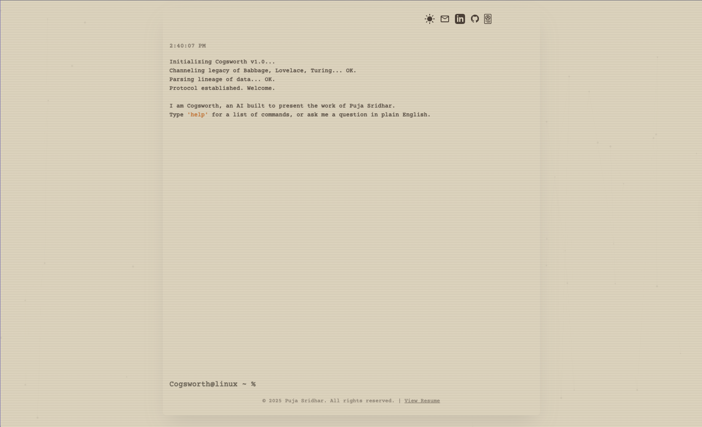

# Puja Sridhar - Interactive AI Portfolio

Welcome to my interactive portfolio, a unique terminal-style website designed to showcase my skills and experience. This project features a custom AI assistant named Cogsworth, built to answer questions about my work in a conversational way.



---

## Features

* **AI Assistant (Cogsworth):** Ask questions in plain English about my experience, projects, or skills, and get a conversational response.
* **Dual View Modes:**
    * **Terminal View:** An interactive, command-line interface where you can use commands like `help`, `projects`, `skills`, etc., to navigate my portfolio.
    * **Standard View:** A traditional, user-friendly GUI for a more standard browsing experience.
* **Dynamic Background:** A subtle, animated network graphic in the background adds a touch of visual flair.
* **Light/Dark Mode:** Toggle between light and dark themes to suit your preference.
* **Responsive Design:** The portfolio is fully responsive and works seamlessly on desktop, tablet, and mobile devices.

---

## Tech Stack

* **Frontend:** HTML5, CSS3, Vanilla JavaScript
* **Styling:** Tailwind CSS
* **AI Integration:** Vercel Serverless Functions to securely call the Gemini API
* **Deployment:** Vercel

---

## Local Setup

To run this project on your local machine, follow these steps:

1.  **Clone the repository:**
    ```bash
    git clone [https://github.com/PujaSridhar/PujaSridhar.github.io.git](https://github.com/PujaSridhar/PujaSridhar.github.io.git)
    ```
2.  **Navigate to the project directory:**
    ```bash
    cd PujaSridhar.github.io
    ```
3.  **Open `index.html` in your browser:**
    * You can simply double-click the `index.html` file, or use a live server extension in your code editor (like Live Server for VS Code) for the best experience.

---

## Contact

Let's connect! You can find me on the following platforms:

* **LinkedIn:** [linkedin.com/in/pujasridhar](https://www.linkedin.com/in/pujasridhar/)
* **GitHub:** [github.com/pujasridhar](https://github.com/pujasridhar)
* **Email:** [pujasridhar28@gmail.com](mailto:pujasridhar28@gmail.com)